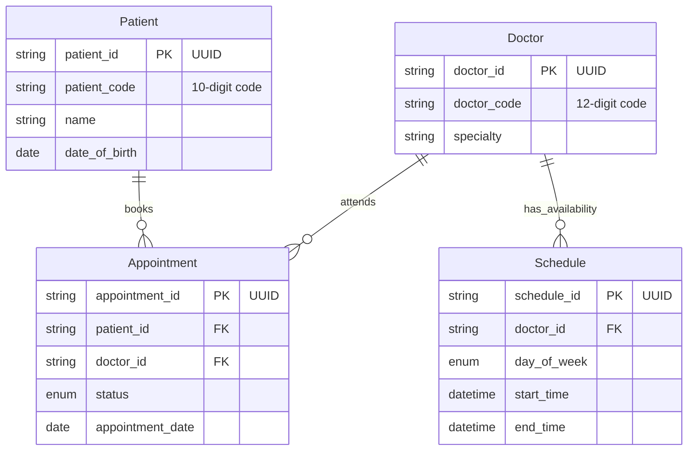

# Hospital Management DB System - MVP DB Design

## 1. Scope Confirmation (Issue #27)

**MVP boundary for patient records and appointment modules.**

### MVP Entities

- **Patient**: Management of demographics and medical history.
- **Doctor**: Profiles with specialized availability tracking.
- **Appointment**: Lifecycle management (Scheduled, Completed, Canceled).
- **Schedule**: Time-slot definitions for doctor availability.
- **UserRole**: Role-based access control (RBAC).

### Non-Goals (Out of Scope for MVP)

- Billing, Insurance claims, Lab result integration, and Pharmacy management.

### Risks & Assumptions

- **Timezone Management**: Schedules assume `timezone=True` to prevent offset errors.
- **Data Integrity**: Enums are enforced at the DB level to prevent invalid appointment states.

---

## 2. Text-Based ERD (Issue #28)

**Standard**: Internal relationships use `UUIDv4` PKs. Human-facing interactions use `10-digit short codes`.

### Entities & Attributes

- **Patient**
  - `patient_id` (PK, UUID)
  - `patient_code` (Unique 10-digit)
  - `name`, `date_of_birth`, `gender`, `contact_info`, `medical_history`
- **Doctor**
  - `doctor_id` (PK, UUID)
  - `doctor_code` (Unique 12-digit)
  - `name`, `specialty`, `contact_info`
- **Schedule**
  - `schedule_id` (PK, UUID)
  - `doctor_id` (FK -> Doctor)
  - `day_of_week` (Enum: Monday-Sunday)
  - `start_time`, `end_time` (DateTime w/ TZ)
- **Appointment**
  - `appointment_id` (PK, UUID)
  - `patient_id` (FK -> Patient)
  - `doctor_id` (FK -> Doctor)
  - `status` (Enum: Scheduled, Completed, Canceled)
  - `appointment_date` (Date), `notes` (Text)

---

## 3. Visual ERD (Issue #29)

_Note: Install the **Markdown Preview Mermaid Support** extension in VS Code to view this diagram._

