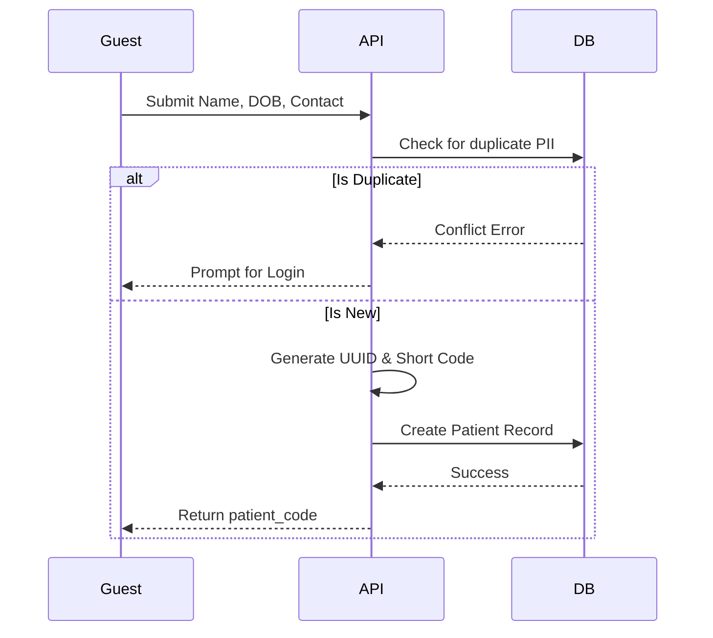
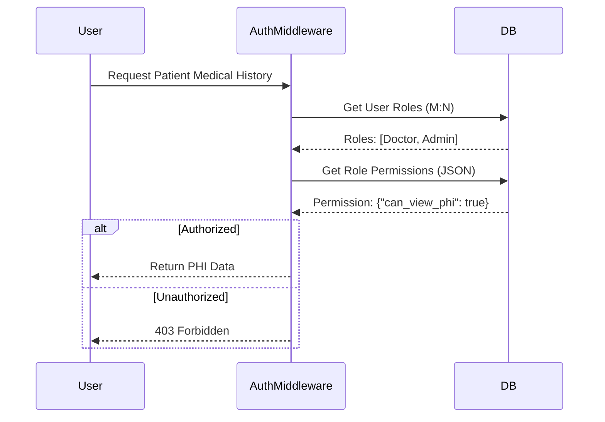

# System Workflows (Mermaid)

## 1. Patient Registration Workflow

How a guest becomes a patient in the system.

---

## 2. Appointment Booking & Conflict Resolution

### Ensures two patients don't get the same slot for the same doctor.

---

# 3. RBAC Permission Flow

### How the system verifies if a user can see medical history.

